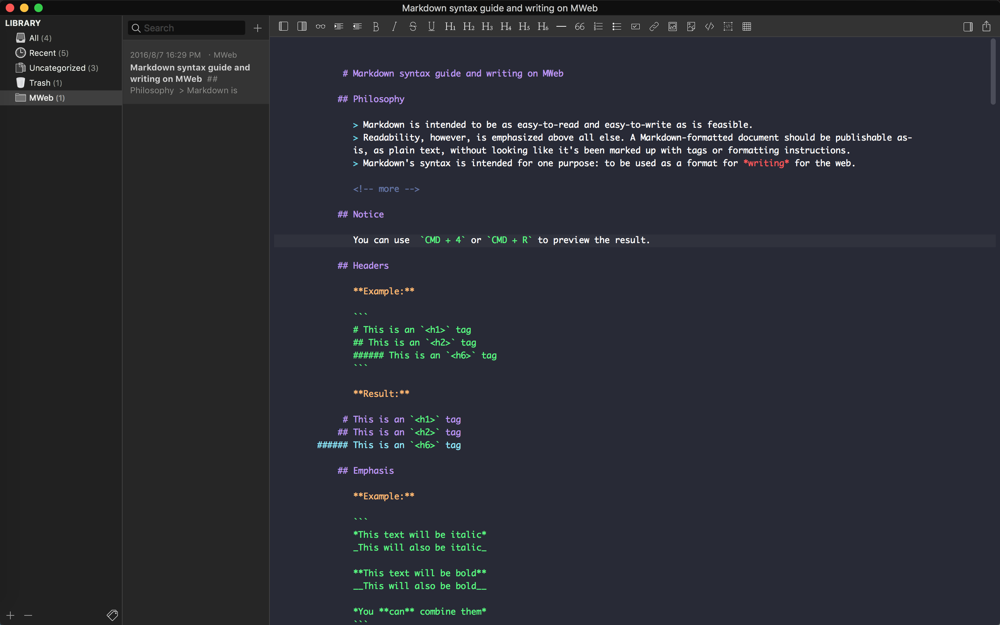

# Dracula for [MWeb](http://www.mweb.im/)

>A dark theme for [Mweb](http://www.mweb.im/)




## Install

### Install using Git

```
$ git clone https://github.com/oneofai/Dracula-for-MWeb.git
```
### Install manually

[Download ZIP](https://github.com/oneofai/Dracula-for-MWeb/archive/master.zip) then unzip it.

## Activating theme

- Go to `Preferences`->`Themes`->`Editor Light Themes`->`Edit...`
- copy the `Dracula.style` file to the `EditorThemes` folder
- `Reload` then select the `Dracula`

## License

[MIT License](./LICENSE)
